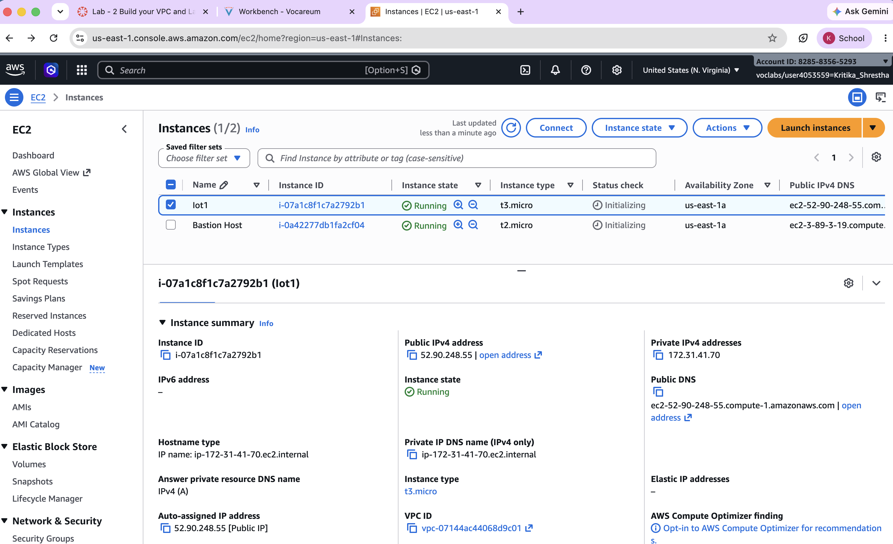
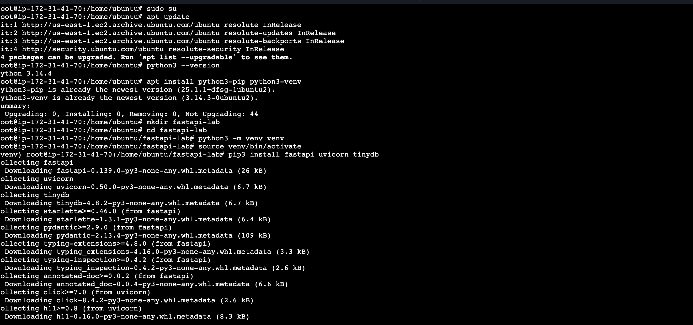
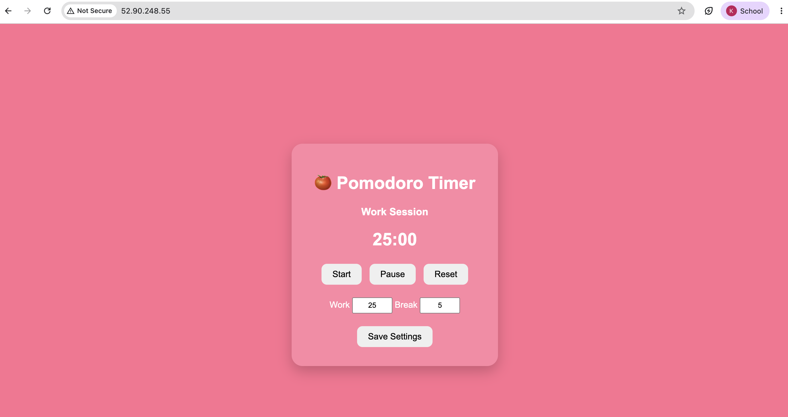

# Lab 1: Hosting a Web Server on the Cloud

## Objective

- Access the AWS Console through the sandbox environment.
- Launch an AWS EC2 instance.
- Connect to the EC2 instance using SSH.
- Install Python, FastAPI, and Uvicorn.
- Deploy a Pomodoro Timer web application using FastAPI.
- Access the hosted application through the EC2 public IP address.

---

# Introduction

Cloud computing enables applications to be hosted on virtual servers that are accessible through the internet. Amazon Web Services (AWS) provides Elastic Compute Cloud (EC2), which allows developers to deploy applications without physical hardware. In this lab, a Pomodoro Timer web application was developed using FastAPI and hosted on an AWS EC2 instance.

---

# Background Theory

## AWS EC2

Amazon Elastic Compute Cloud (EC2) is a cloud service that provides scalable virtual machines for deploying applications.

## FastAPI

FastAPI is a modern, high-performance Python framework used for building APIs and web applications.

## Uvicorn

Uvicorn is an ASGI server used to run FastAPI applications.

## Cloud Hosting

Cloud hosting allows applications to be accessed from anywhere using the public IP address of the server.

---

# AWS EC2 Instance

**Instance Name:** Iot1

**Instance Type:** t3.micro

**Operating System:** Ubuntu

**Public IP:** 52.90.248.55

**Status:** Running

<div align="center">

</div>

---

# Environment Setup

Commands used during installation:

```bash
sudo su

apt update

python3 --version

apt install python3-pip python3-venv

mkdir fastapi-lab

cd fastapi-lab

python3 -m venv venv

source venv/bin/activate

pip3 install fastapi uvicorn

nano app.py

uvicorn app:app --host 0.0.0.0 --port 80
```

<div align="center">

</div>

---

# FastAPI Application Code

```python
from fastapi import FastAPI
from fastapi.responses import HTMLResponse
from pydantic import BaseModel

app = FastAPI(title="Pomodoro Timer API")

class TimerSettings(BaseModel):
    work: int
    break_time: int

timer = {
    "work": 25,
    "break": 5,
    "current_time": "25:00",
    "running": False,
    "mode": "Work Session"
}

@app.get("/", response_class=HTMLResponse)
def home():
    return f"""
<!DOCTYPE html>
<html>
<head>
<title>Pomodoro Timer</title>
<style>
body {{
    background:#ff6f91;
    font-family:Arial;
    display:flex;
    justify-content:center;
    align-items:center;
    height:100vh;
}}

.card {{
    background:#ff87a5;
    padding:30px;
    border-radius:20px;
    width:320px;
    text-align:center;
    color:white;
    box-shadow:0 10px 25px rgba(0,0,0,.2);
}}

button {{
    padding:10px 20px;
    margin:5px;
    border:none;
    border-radius:10px;
    cursor:pointer;
    font-size:16px;
}}

input {{
    width:60px;
    padding:5px;
    text-align:center;
}}

</style>
</head>

<body>

<div class="card">

<h1>🍅 Pomodoro Timer</h1>

<h3 id="mode">{timer["mode"]}</h3>

<h1 id="time">{timer["current_time"]}</h1>

<button onclick="start()">Start</button>
<button onclick="pause()">Pause</button>
<button onclick="reset()">Reset</button>

<br><br>

<label>Work</label>
<input id="work" value="{timer["work"]}">

<label>Break</label>
<input id="break" value="{timer["break"]}">

<br><br>

<button onclick="save()">Save Settings</button>

</div>

<script>

async function refresh(){
let r=await fetch('/timer');
let d=await r.json();
document.getElementById('mode').innerHTML=d.mode;
document.getElementById('time').innerHTML=d.time;
}

async function start(){
await fetch('/start',{method:'POST'});
refresh();
}

async function pause(){
await fetch('/pause',{method:'POST'});
refresh();
}

async function reset(){
await fetch('/reset',{method:'POST'});
refresh();
}

async function save(){

let work=document.getElementById('work').value;
let br=document.getElementById('break').value;

await fetch('/settings',{

method:'POST',

headers:{
'Content-Type':'application/json'
},

body:JSON.stringify({

work:Number(work),
break_time:Number(br)

})

});

refresh();

}

</script>

</body>
</html>
"""

@app.get("/timer")
def timer_api():
    return {
        "mode": timer["mode"],
        "time": timer["current_time"],
        "work": timer["work"],
        "break": timer["break"],
        "running": timer["running"]
    }

@app.post("/start")
def start():
    timer["running"] = True
    return {"message":"started"}

@app.post("/pause")
def pause():
    timer["running"] = False
    return {"message":"paused"}

@app.post("/reset")
def reset():
    timer["running"] = False
    timer["mode"] = "Work Session"
    timer["current_time"] = f"{timer['work']:02}:00"
    return {"message":"reset"}

@app.post("/settings")
def settings(data: TimerSettings):
    timer["work"] = data.work
    timer["break"] = data.break_time
    timer["current_time"] = f"{data.work:02}:00"
    return {"message":"updated"}
```

---

# Procedure

1. Logged into AWS Academy Sandbox.
2. Launched an Ubuntu EC2 instance.
3. Connected to the instance using SSH.
4. Updated Ubuntu packages.
5. Installed Python, pip, FastAPI, and Uvicorn.
6. Created the FastAPI application (`app.py`).
7. Started the application using:

```bash
uvicorn app:app --host 0.0.0.0 --port 80
```

8. Accessed the application using the EC2 public IP address.
9. Verified that the Pomodoro Timer webpage loaded successfully.

---

# Output

<div align="center">

</div>


---

# Result

- Successfully launched an AWS EC2 instance.
- Successfully installed the required Python packages.
- Successfully deployed the FastAPI application.
- Successfully hosted the Pomodoro Timer webpage on the cloud.
- The application was accessible through the EC2 public IP.

---

# Conclusion

This lab successfully demonstrated the deployment of a FastAPI web application on AWS EC2. The EC2 instance was configured with Python and Uvicorn, and the Pomodoro Timer application was hosted successfully. The application was accessible through a web browser using the EC2 public IP address, providing practical experience with cloud computing, web application deployment, and FastAPI development.