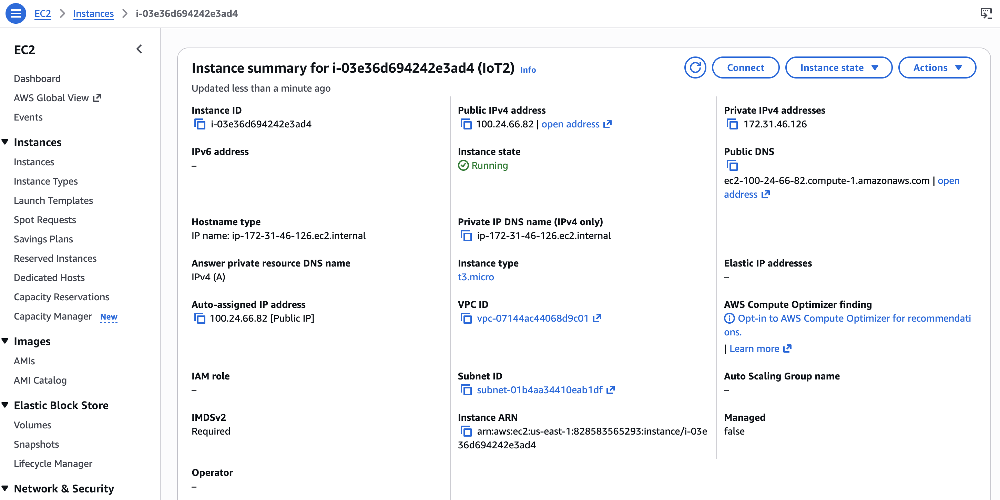
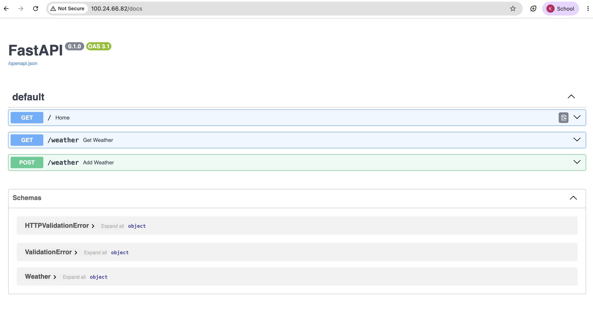
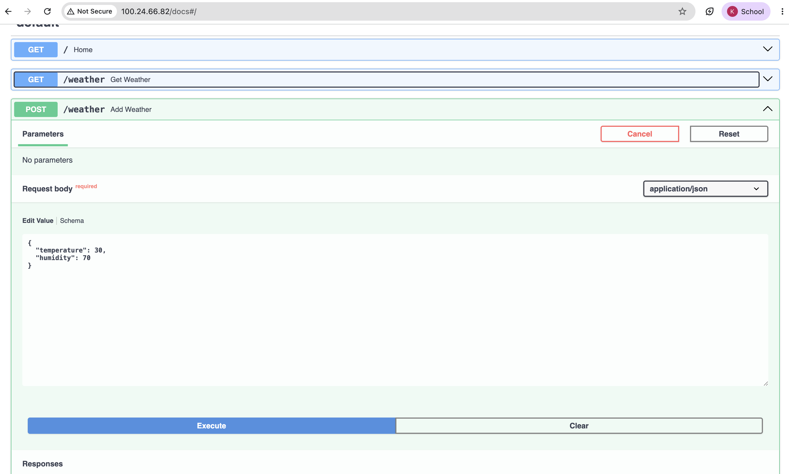
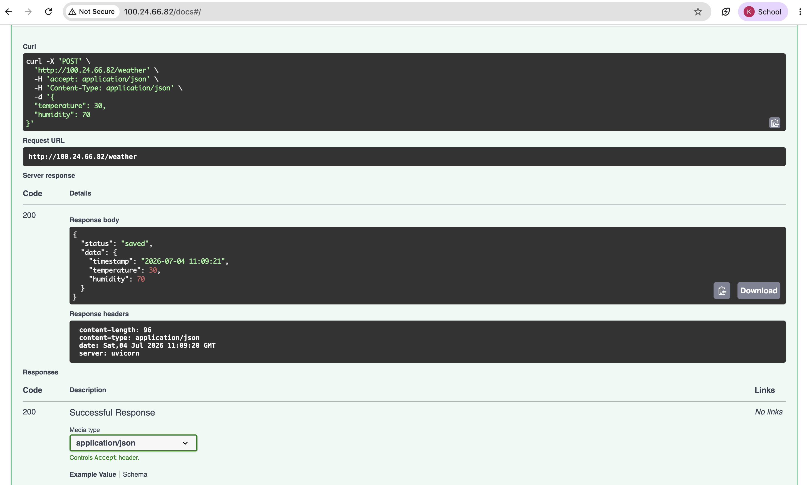
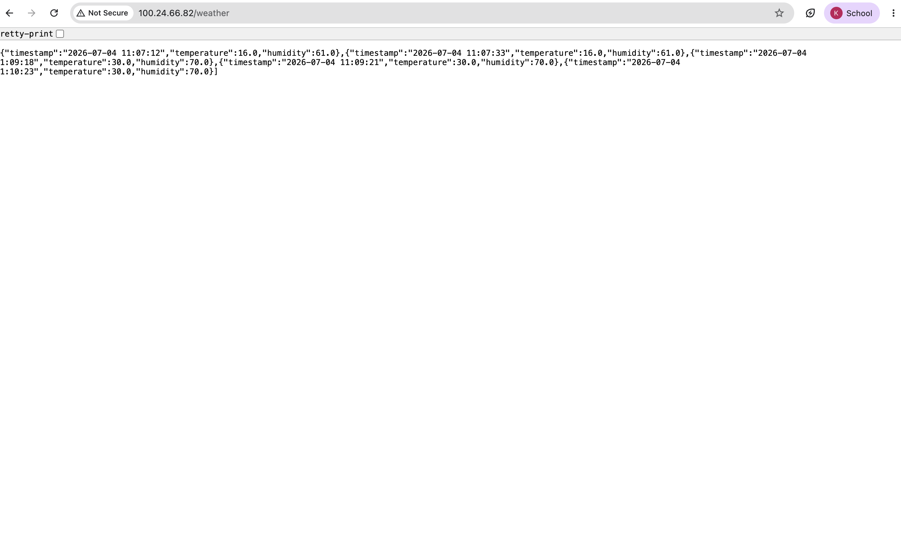

# Lab 2: Developing and Deploying a REST API to Store Data on Cloud


# Objective

- Launch and configure an AWS EC2 instance for cloud deployment.
- Set up a Python environment on the cloud server.
- Install FastAPI, Uvicorn, TinyDB, and Pydantic.
- Develop a REST API to receive and store temperature and humidity data.
- Implement persistent data storage with timestamps.
- Test the API using Swagger UI, curl, and a web browser.
- Understand cloud-based IoT data collection systems.

---

# Introduction

The Internet of Things (IoT) allows smart devices to collect environmental data such as temperature and humidity. Cloud computing enables this data to be stored remotely and accessed from anywhere. In this laboratory, a REST API was developed using FastAPI and deployed on an AWS EC2 instance. The API receives temperature and humidity readings through HTTP POST requests, stores them in TinyDB with timestamps, and retrieves stored records using HTTP GET requests.

---

# Background Theory

## AWS EC2

Amazon Elastic Compute Cloud (EC2) is a cloud service that provides virtual servers for deploying applications.

### Features

- Virtual cloud server
- Remote SSH access
- Public IP address
- Scalable infrastructure
- Suitable for hosting web applications

---

## FastAPI

FastAPI is a modern Python framework for building high-performance REST APIs.

### Advantages

- Fast and lightweight
- Automatic Swagger documentation
- Request validation using Pydantic
- Easy to learn and use

---

## TinyDB

TinyDB is a lightweight NoSQL database that stores data in JSON format.

### Advantages

- No database server required
- Persistent storage
- Simple to configure
- Ideal for small IoT applications

---

## Pydantic

Pydantic validates incoming request data before processing.

Example:

```python
class Weather(BaseModel):
    temperature: float
    humidity: float
```

---

## REST API

REST (Representational State Transfer) is an architectural style used for communication between clients and servers.

| HTTP Method | Purpose |
|-------------|---------|
| GET | Retrieve data |
| POST | Insert data |
| PUT | Update data |
| DELETE | Remove data |

---

# AWS EC2 Instance

<p align="center">

</p>

### Instance Details

| Property | Value |
|----------|-------|
| Instance ID | i-03e36d694242e3ad4 |
| Instance Type | t3.micro |
| Public IP | 100.24.66.82 |
| Platform | Ubuntu Linux |
| Status | Running |

---

# Software Requirements

- Ubuntu Linux
- AWS EC2
- Python 3.14
- FastAPI
- Uvicorn
- TinyDB
- Pydantic
- SSH Terminal
- Web Browser

---

# FastAPI Application Code

```python
from fastapi import FastAPI
from tinydb import TinyDB
from pydantic import BaseModel
from datetime import datetime

app = FastAPI()

db = TinyDB("db.json")

class Weather(BaseModel):
    temperature: float
    humidity: float

@app.get("/")
def home():
    return {"message": "Weather API Running"}

@app.post("/weather")
def add_weather(weather: Weather):

    data = {
        "timestamp": datetime.now().strftime("%Y-%m-%d %H:%M:%S"),
        "temperature": weather.temperature,
        "humidity": weather.humidity
    }

    db.insert(data)

    return {
        "status": "saved",
        "data": data
    }

@app.get("/weather")
def get_weather():
    return db.all()
```

---

# FastAPI Documentation (Swagger UI)

<p align="center">

</p>

**Figure 1:** Swagger UI generated automatically by FastAPI.

---

# Testing POST Endpoint

## Using Swagger UI

<p align="center">

</p>

**Figure 2:** Sending weather data through Swagger UI.

---

## Using curl

```bash
curl -X POST "http://100.24.66.82/weather" \
-H "Content-Type: application/json" \
-d '{
  "temperature": 28.5,
  "humidity": 75
}'
```

<p align="center">

</p>

**Figure 3:** POST request using curl.

---

# Testing GET Endpoint

<p align="center">

</p>

**Figure 4:** Retrieving stored weather records.

---

# Procedure

1. Launched an AWS EC2 Ubuntu instance.
2. Connected to the server using SSH.
3. Updated the system packages.
4. Installed FastAPI, Uvicorn, TinyDB, and Pydantic.
5. Created the FastAPI application (`app.py`).
6. Started the server using:

```bash
uvicorn app:app --host 0.0.0.0 --port 80
```

7. Opened Swagger documentation:

```
http://100.24.66.82/docs
```

8. Tested the POST endpoint using Swagger UI and curl.
9. Verified that the sensor data was stored in `db.json`.
10. Retrieved all stored records using the GET endpoint.

---

# API Endpoints

| Method | Endpoint | Description |
|--------|----------|-------------|
| GET | / | Home Page |
| POST | /weather | Store weather data |
| GET | /weather | Retrieve stored weather data |

---

# Result

The REST API was successfully deployed on the AWS EC2 cloud server. The POST endpoint correctly accepted temperature and humidity values and stored them in TinyDB along with timestamps. The GET endpoint successfully retrieved all stored weather records. Swagger UI automatically generated interactive API documentation, making API testing simple and efficient.

---

# Advantages

- Lightweight implementation
- Fast API response
- Automatic API documentation
- Persistent JSON database
- Easy cloud deployment
- Suitable for IoT applications

---

# Applications

- Smart Weather Monitoring
- Smart Agriculture
- Environmental Monitoring
- Smart Home Systems
- Industrial IoT
- Remote Sensor Networks

---

# Conclusion

This laboratory successfully demonstrated the complete process of developing and deploying a cloud-based REST API using AWS EC2, FastAPI, TinyDB, and Pydantic. The API successfully received temperature and humidity readings, validated the incoming data, stored the readings with timestamps, and retrieved them through RESTful endpoints. Deployment on AWS EC2 provided practical experience in cloud computing and API development. This implementation forms a strong foundation for cloud-based IoT data collection and monitoring systems.