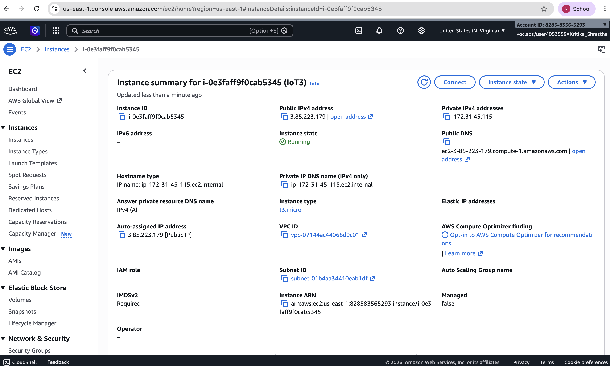
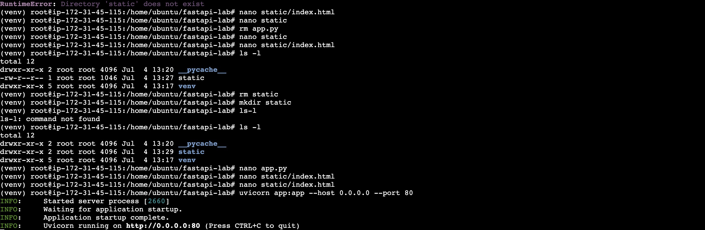
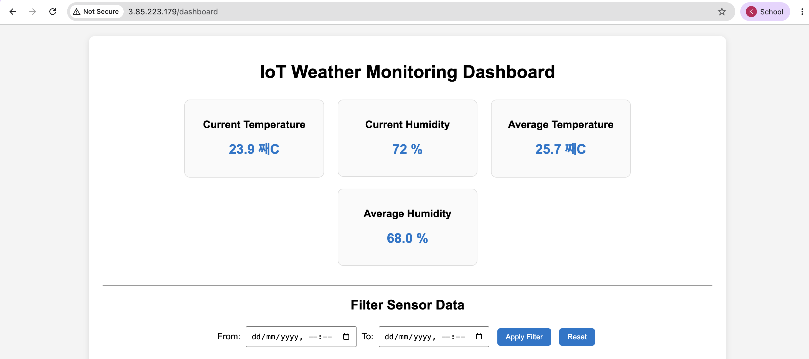
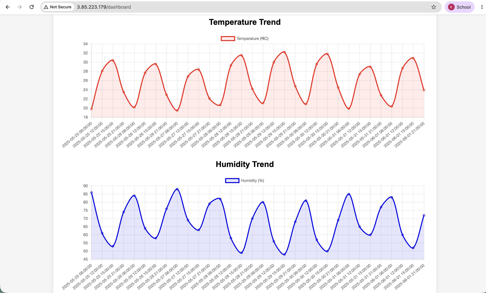
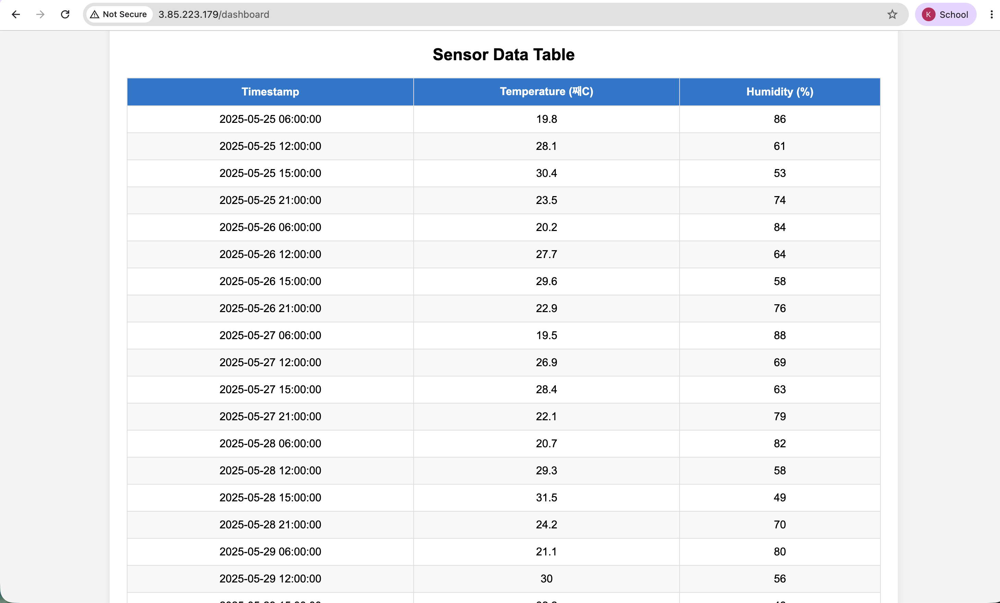
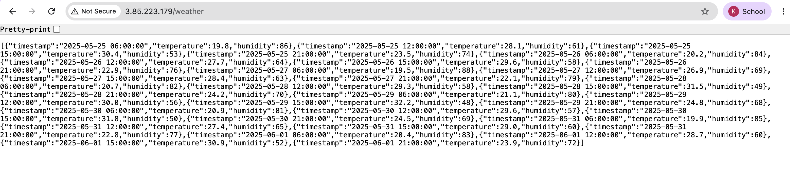

# Lab 3: Visualizing IoT Sensor Data Using Interactive Dashboards

## Objectives
1. Retrieve stored sensor data from the REST API developed in Lab 2.
2. Understand the importance of data visualization in IoT systems.
3. Develop a web-based dashboard to display sensor data.
4. Create real-time and historical visualizations of temperature and humidity data.
5. Deploy the dashboard on the AWS EC2 instance.
6. Analyze sensor trends using graphical representations.

## Background Theory

### Data Visualization in IoT
IoT devices continuously generate large amounts of sensor data. Visualizing this information through graphs, charts, and dashboards helps users understand environmental conditions, identify trends, and make informed decisions. Interactive visualization improves monitoring efficiency compared to viewing raw numerical data.

### API-Oriented Architecture
An API enables communication between different software components. In this lab, the FastAPI REST API retrieves temperature and humidity records stored in TinyDB and provides them in JSON format. The dashboard consumes these API endpoints using JavaScript Fetch API.

### Dashboard Systems
A dashboard is a web interface that displays important information in an organized manner. It presents current sensor values, average readings, graphical trends, and historical data tables. Dashboards make IoT monitoring simple and user-friendly.

### Designing Data Filters
Filtering allows users to select a specific date and time range for analysis. The dashboard sends the selected dates to the REST API, which returns only the records within the specified interval. This feature enables historical data analysis and comparison.

## Procedure
1. Created a FastAPI application that retrieves weather sensor data from TinyDB.
2. Mounted the static directory using `FastAPI StaticFiles` to serve the HTML dashboard.
3. Developed an interactive dashboard using HTML, CSS, and JavaScript.
4. Integrated Chart.js library to visualize temperature and humidity trends.
5. Implemented REST API endpoints:
   - `GET /weather` – Retrieve all weather records
   - `GET /weather?start=&end=` – Retrieve filtered records
   - `POST /weather` – Insert new sensor readings
6. Displayed current temperature, humidity, and averages using dashboard cards.
7. Displayed historical data using Temperature line chart, Humidity line chart, and Data table.
8. Implemented date-time filtering using HTML datetime-local inputs.
9. Deployed the application on an AWS EC2 Ubuntu instance (`t3.micro`).
10. Started the FastAPI server using:
    ```bash
    uvicorn app:app --host 0.0.0.0 --port 80
    ```
11. Accessed the dashboard via the public IP: `http://3.85.223.179/dashboard`

## Output

















## Result
The IoT Weather Monitoring Dashboard successfully retrieved temperature and humidity records from the FastAPI REST API and displayed them using interactive charts, summary cards, and a data table. The application was successfully deployed on an AWS EC2 instance and could be accessed through its public IP address. Historical sensor data filtering based on date and time was also implemented successfully.

## Conclusion
This lab demonstrated how IoT sensor data can be visualized using a web-based dashboard. FastAPI served as the backend API, TinyDB stored sensor readings, and Chart.js provided interactive visualizations. Deploying the application on AWS EC2 made it accessible remotely through a web browser. The dashboard enables users to monitor current environmental conditions, analyze historical trends, and filter sensor data efficiently, making it a practical solution for IoT monitoring applications.
