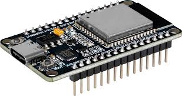
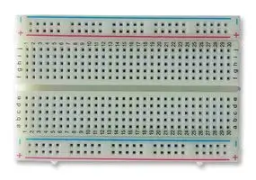
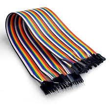
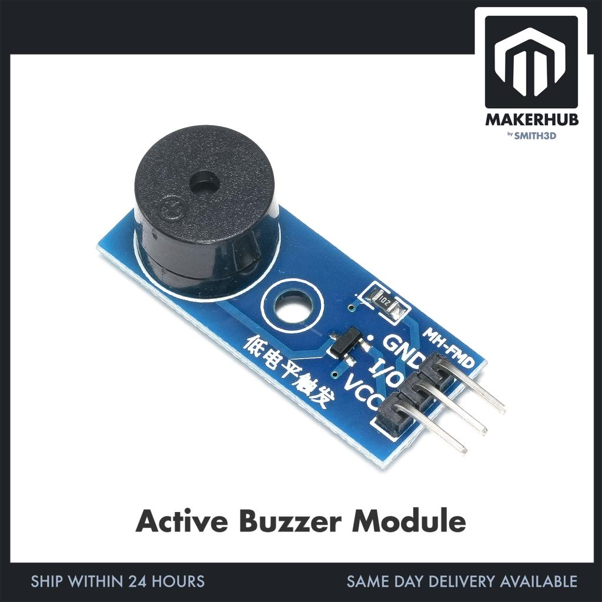

# Lab Report: Sensor Devices Used in IoT Projects

## Objective

- To study commonly used sensor devices in IoT systems
- To understand working principles of different sensors and modules
- To identify applications of sensors in real world IoT projects
- To learn hardware components used in project development

---

## Introduction

Internet of Things (IoT) systems connect physical devices to the internet so they can collect and exchange data. Sensors are the main input devices in IoT systems. They detect changes in the environment and send signals to microcontrollers like ESP32 or Arduino for processing.

This lab focuses on commonly used sensor devices and electronic components used in student IoT projects.

---

## Components Studied

### 1. ESP32 Development Board

**Example Device:** ESP32 DevKit V1

ESP32 is a powerful microcontroller with built-in WiFi and Bluetooth, commonly used as the main controller in IoT projects.

  

**Applications:**
- Smart home automation
- IoT monitoring systems
- Wireless communication systems
- Safety and tracking devices

---

### 2. Breadboard

**Example Device:** MB-102 Breadboard

A breadboard is used for building and testing circuits without soldering.

  

**Applications:**
- Circuit prototyping
- Testing electronic components
- Educational experiments

---

### 3. Jumper Wires

**Example Device:** Male-to-Male Jumper Wires

Used to make connections between components on a breadboard.

  

**Applications:**
- Sensor connections
- Circuit assembly
- Prototype development

---

### 4. Temperature and Humidity Sensor

**Example Device:** DHT11 Sensor

Measures temperature and humidity levels in the environment.

  

**Applications:**
- Weather monitoring stations
- Agriculture and greenhouse systems
- Environmental tracking

---

### 5. Gas Sensor

**Example Device:** MQ-2 Gas Sensor

Detects gases like LPG, smoke, methane, and alcohol.

  

**Applications:**
- Gas leakage detection
- Fire safety systems
- Air quality monitoring

---

### 6. Ultrasonic Distance Sensor

**Example Device:** HC-SR04 Ultrasonic Sensor

Measures distance using ultrasonic sound waves.

  

**Applications:**
- Smart parking systems
- Obstacle detection
- Liquid level measurement

---

### 7. PIR Motion Sensor

**Example Device:** HC-SR501 PIR Sensor

Detects human or animal movement using infrared radiation.

  

**Applications:**
- Security alarms
- Automatic lighting systems
- Smart home automation

---

### 8. Camera Module (ESP32-CAM)

**Example Device:** ESP32-CAM with OV2640

Used for image and video capture, including face detection capabilities.

  

**Applications:**
- Attendance systems with face recognition
- Security surveillance
- Remote monitoring

---

### 9. GPS Module

**Example Device:** NEO-6M GPS Module

Provides accurate location and time information using satellite signals.

  

**Applications:**
- Vehicle tracking systems
- Women safety devices
- Navigation and fleet management

---

### 10. GSM Module

**Example Device:** SIM800L GSM Module

Enables SMS, calls, and GPRS communication.

  

**Applications:**
- Emergency alert systems
- Remote monitoring and control
- SMS-based notifications

---

### 11. Light Sensor

**Example Device:** LDR (Light Dependent Resistor) Module

Detects ambient light intensity.

  

**Applications:**
- Automatic street lights
- Smart lighting control
- Energy saving systems

---

### 12. Vibration Sensor

**Example Device:** SW-420 Vibration Sensor

Detects vibrations, shocks, or sudden movements.

  

**Applications:**
- Anti-theft systems
- Accident detection
- Equipment health monitoring

---

### 13. Buzzer Module

**Example Device:** Active Buzzer Module

Produces audible alerts and beeps.

  

**Applications:**
- Alarm systems
- Notification sounds
- Feedback mechanisms

---

### 14. RFID Reader Module

**Example Device:** MFRC522 RFID Reader

Reads RFID tags and cards for identification.

  

**Applications:**
- Attendance management
- Access control systems
- Inventory tracking

---

## Apparatus Required

- ESP32 DevKit V1
- Breadboard
- Jumper Wires
- DHT11 Sensor
- MQ-2 Gas Sensor
- HC-SR04 Ultrasonic Sensor
- HC-SR501 PIR Sensor
- ESP32-CAM Module
- NEO-6M GPS Module
- SIM800L GSM Module
- LDR Module
- SW-420 Vibration Sensor
- Active Buzzer
- MFRC522 RFID Module
- USB Cable
- Laptop with Arduino IDE / ESP-IDF

---

## Procedure

1. Collect all the sensor modules and components listed above.
2. Study the pin configuration and specifications of each sensor.
3. Connect sensors to the ESP32 using breadboard and jumper wires.
4. Write and upload sample code to test each sensor.
5. Observe readings on the Serial Monitor.
6. Document observations and applications.

---

## Observation Table

| Device                  | Function                    | Key Application              |
|-------------------------|-----------------------------|------------------------------|
| ESP32 DevKit V1        | Main controller + WiFi/BT  | IoT systems                  |
| DHT11                  | Temp & Humidity             | Environmental monitoring     |
| MQ-2                   | Gas / Smoke detection       | Safety systems               |
| HC-SR04                | Distance measurement        | Smart parking / robotics     |
| HC-SR501 PIR           | Motion detection            | Security alarms              |
| ESP32-CAM              | Image / Face detection      | Surveillance                 |
| NEO-6M GPS             | Location tracking           | Tracking systems             |
| SIM800L GSM            | SMS / Calls                 | Emergency alerts             |
| LDR                    | Light intensity             | Smart lighting               |
| SW-420                 | Vibration detection         | Theft / Accident detection   |
| Active Buzzer          | Audio alerts                | Alarms                       |
| MFRC522 RFID           | Tag / Card reading          | Attendance / Access control  |

---

## Result

All sensor devices were successfully studied. Their working principles, pin configurations, and practical IoT applications were understood.

---

## Conclusion

This lab provided comprehensive knowledge of essential IoT hardware components. Sensors like DHT11, MQ-2, HC-SR04, PIR, ESP32-CAM, GPS, GSM, and RFID are fundamental building blocks for developing real-world smart systems such as home automation, security solutions, tracking devices, and environmental monitors.

Breadboard and jumper wires greatly simplify the prototyping process, making IoT development accessible for students and beginners.

---
