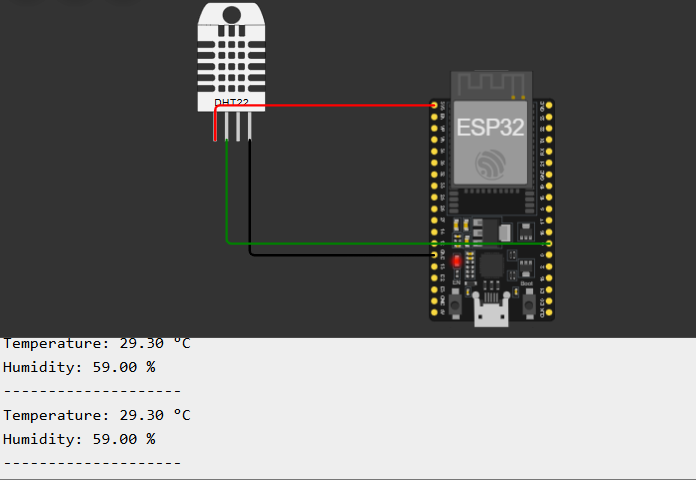
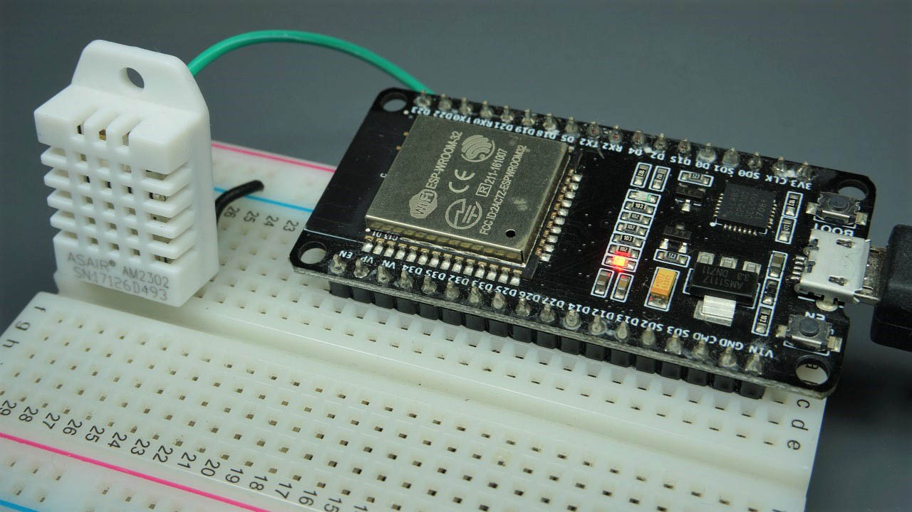
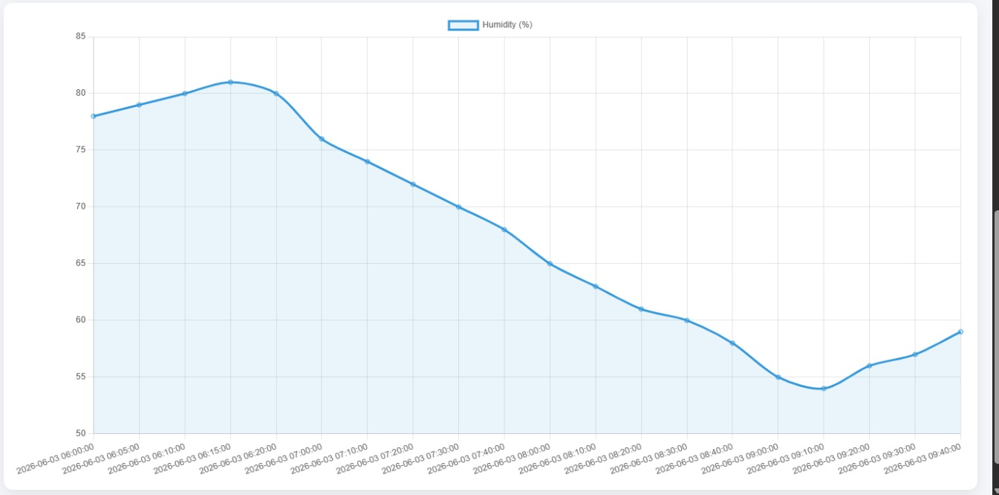
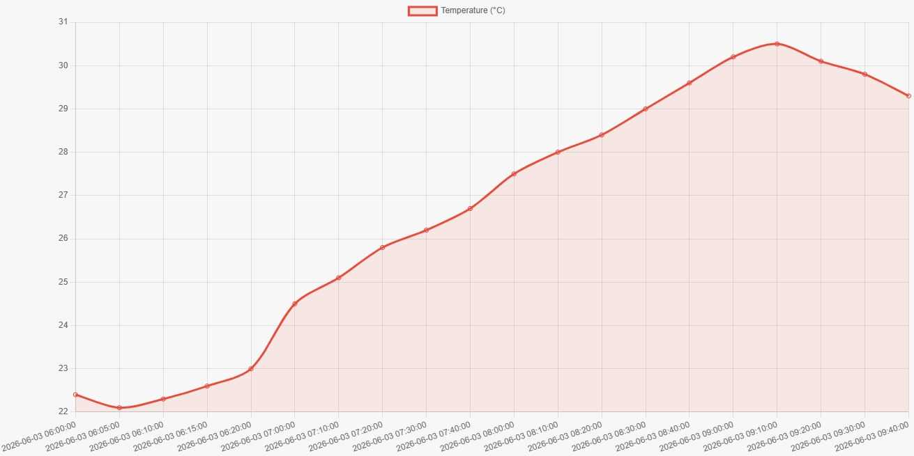

# **Lab 5**

# **Title**

**Integrating ESP32 Sensor Data with Cloud-Based REST API and Dashboard Visualization**

---

# **Objectives**

1. Interface the DHT22 temperature and humidity sensor with the ESP32.
2. Read and display sensor data on the Arduino Serial Monitor.
3. Connect the ESP32 to a Wi-Fi network.
4. Send sensor readings to the REST API hosted on an AWS EC2 instance.
5. Store sensor data in the cloud database.
6. Retrieve the stored data using the REST API.
7. Visualize real-time and historical sensor data through the web dashboard.
8. Understand the complete IoT workflow from sensing to cloud visualization.

---

# **Background Theory**

## ESP32 Microcontroller

The ESP32 is a powerful microcontroller with built-in Wi-Fi and Bluetooth capabilities. It is widely used in Internet of Things (IoT) applications because it can collect sensor data and communicate with cloud servers over the internet.

## DHT22 Temperature and Humidity Sensor

The DHT22 is a digital sensor capable of measuring temperature and relative humidity. It provides more accurate readings than the DHT11 and communicates with the ESP32 using a single-wire digital interface.

## Sensor Data Acquisition

Sensor data acquisition is the process of collecting physical environmental information, such as temperature and humidity, from sensors and converting it into digital data that can be processed by a microcontroller.

## Serial Communication

Serial communication allows the ESP32 to transmit sensor readings to the Arduino IDE Serial Monitor for debugging and verification before sending the data to the cloud.

## REST API Communication

A REST API allows communication between IoT devices and cloud servers using HTTP requests. In this lab, the ESP32 sends temperature and humidity readings using HTTP POST requests, while the dashboard retrieves the data using HTTP GET requests.

## Cloud Data Storage on AWS EC2

The REST API is deployed on an AWS EC2 Ubuntu instance. Sensor readings received from the ESP32 are stored in a TinyDB database, making them available for remote monitoring and analysis.

## API Integration with Embedded Systems

Embedded systems such as the ESP32 can communicate directly with cloud services through REST APIs, enabling real-time IoT applications without requiring intermediate devices.

## IoT Data Flow

The complete IoT data flow in this experiment is:

**DHT22 Sensor → ESP32 → Wi-Fi → REST API → AWS EC2 → TinyDB Database → Dashboard**

## Dashboard-Based Data Visualization

The web dashboard displays the latest sensor readings as well as historical temperature and humidity trends using interactive charts, allowing users to monitor environmental conditions remotely.

---

# **Procedure**

1. Connected the DHT22 sensor to the ESP32 according to the wiring diagram.
2. Installed the required Arduino libraries (DHT Sensor Library and HTTPClient).
3. Uploaded the first program to verify temperature and humidity readings through the Serial Monitor.
4. Verified that the DHT22 sensor was functioning correctly.
5. Connected the ESP32 to the local Wi-Fi network using the SSID and password.
6. Configured the REST API endpoint hosted on the AWS EC2 instance.
7. Modified the ESP32 program to send temperature and humidity data using HTTP POST requests.
8. Uploaded the modified program to the ESP32.
9. Verified successful HTTP responses from the server through the Serial Monitor.
10. Confirmed that the uploaded sensor data was stored in the cloud database.
11. Opened the IoT Weather Monitoring Dashboard in a web browser.
12. Observed the uploaded sensor data displayed as real-time values and historical graphs.

---

# **Output**

# **Result**

The ESP32 successfully collected temperature and humidity readings from the DHT22 sensor and displayed them on the Arduino Serial Monitor. After establishing a Wi-Fi connection, the ESP32 transmitted the sensor readings to the REST API hosted on the AWS EC2 instance using HTTP POST requests. The server successfully stored the uploaded data in the TinyDB database. The IoT dashboard retrieved the stored data through the REST API and displayed both the latest sensor values and historical temperature and humidity trends using interactive charts. The experiment confirmed successful end-to-end communication between the IoT device and the cloud platform.

---

# **Conclusion**

This laboratory successfully demonstrated the integration of an ESP32-based IoT device with a cloud-hosted REST API and web dashboard. The DHT22 sensor measured environmental temperature and humidity, while the ESP32 transmitted the collected data to the AWS EC2 server through Wi-Fi using HTTP POST requests. The cloud server stored the sensor readings in a TinyDB database, and the web dashboard retrieved and visualized the data using interactive graphs. The experiment illustrated the complete IoT workflow—from data acquisition and cloud communication to storage and real-time visualization—providing practical experience in developing cloud-based IoT monitoring systems.
